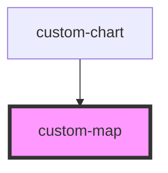

# custom-map

<!-- Auto Generated Below -->

## Properties

| Property  | Attribute | Description | Type  | Default     |
| --------- | --------- | ----------- | ----- | ----------- |
| `version` | `version` |             | `any` | `undefined` |

## Events

| Event       | Description | Type               |
| ----------- | ----------- | ------------------ |
| `mapLoaded` |             | `CustomEvent<any>` |

## Dependencies

### Used by

 - [custom-chart](../custom-chart)

### Graph

----------------------------------------------

*Built with [StencilJS](https://stenciljs.com/)*
